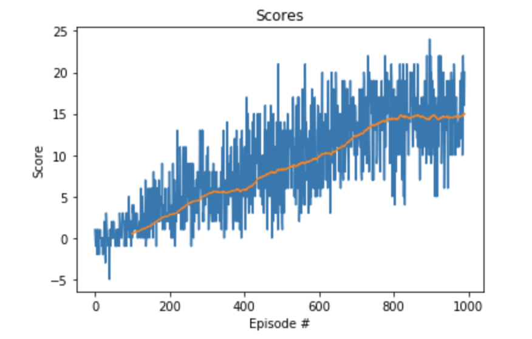

## Report regarding training of double DQN agent to play Udacity's Navigation game


###  Problem Statement

This project implements the training and inference of Udacity's  [Navigation environment](https://github.com/udacity/deep-reinforcement-learning/tree/master/p1_navigation), which is a slightly modified version of Unity ML Agents'  [Banana Collector environment](https://github.com/Unity-Technologies/ml-agents/blob/master/docs/Learning-Environment-Examples.md). The goal is to collect as many yellow bananas as possible, while avoiding blue bananas. Collecting a yellow banana gives a reward of +1, while collecting a blue banana gives a reward of -1. The agent has 4 actions to choose from: move left/right/forward/backward. This is an episodic task. The environment is considered solved if the agent gets an average score of +13 over 100 consecutive episodes. The state space has 37 dimensions. These dimensions represent the ray-based perception of objects around the agent's forward direction, as well as the agent's velocity.

### Learning Algorithm

I decided to use the [Double DQN algorithm](https://arxiv.org/pdf/1509.06461.pdf) in my solution. While the [original DQN paper](https://www.cs.toronto.edu/~vmnih/docs/dqn.pdf) addressed many problems with using neural networks for Q learning, including addressing target-prediction correlation via fixed Q targets and temporal correlation between training samples using experience replay, the standard DQN approach still suffers from too high reward estimates. This biases training and can lead to a suboptimal model after convergence. While the standard DQN uses fixed Q targets (slightly "dated" weights that either remain constant for a few steps) to both predict the best action and to evaluate it to generate the target, the Double DQN approach uses the "local" DQN (the one being trained to be used in inference) to predict the best action and the fixed-Q DQN to evaluate the value of the action to provide the target reward. Both the DQN and double DQN use the local DQN to generate predicted rewards to compare against the target, in order to obtain the loss. Since in the double DQN, the weights used to choose the action with the maximum reward and to evaluate the value of the reward are different, the Double DQN-generated reward target is much less likely to be overestimated. For example, if the max-value action selected using the local DQN is not the max-value action according to the target DQN, the generated target will be lower. The reward will only be at a maximum if the networks using both sets of weights "agree."  In practice, this is good enough to reduce the bias in the target value used in training. The original Double DQN paper used two sets of weights to generate the target, but in practice one of them could simply use the weights from the fixed-target approach from the traditional DQN. 

The DQN itself is very straightforward - just like in the lunar lander problem, I'm using two fully-connected layers (Linear layers in PyTorch parlance), both with default hidden size of 64. There is a ReLU activation after each of the layers. One thing that I added to this model is 1D batch normalization. As per the [Batchnorm paper](https://arxiv.org/pdf/1502.03167.pdf), this improves training because normalized values don't require involved searches to find good weight initialization. Non-normalized outputs also require more tuning of the learning rate, and as the distributions of each layer change during training, this makes it harder for layers that interact with those layers to learn. Moreover, preventing large variations in values of layer outputs, it acts as a regularizer.  The last linear layer doesn't have an activation, since it's simply a linear projection from the hidden state dimensionality to the dimensionality required by the action space (in this case, 4). Hence, the network is simply 
```
Linear -> BN (batchnorm) -> ReLU -> Linear -> BN -> ReLU -> Linear
```
See [model.py](https://github.com/mkolod/deep-reinforcement-learning/blob/master/p1_navigation/model.py) for details.

### Implementation

The double DQN agent follows a standard Q-learning procedure. First, let's focus on the part in which the agent gets a state, and uses the neural network described above to select the best action. This is done in the agent's [act method](https://github.com/mkolod/deep-reinforcement-learning/blob/master/p1_navigation/ddqn_agent.py#L59:L78). Note that since constant exploitation of the existing policy would likely result in the agent missing the opportunity to learn better policies. This is the exploration-exploitation dilemma, which is well known from traditional reinforcement learning. In order to exploit the best policy that seems best until now, while still exploring other actions for a given state, we use an epsilon-greedy policy. 

The epsilon, which determines the probability of the random action being chosen instead of the action which gives the maximum reward, is determined by the client of the Agent class. This client is wrapped in the ddqn function in cell #7 of the [Jupyter notebook](https://github.com/mkolod/deep-reinforcement-learning/blob/master/p1_navigation/Navigation.ipynb). Since RL models are known to converge by following the Greedy in the Limit with Infinite Exploration (GLIE) approach, we need to shrink the epsilon over time. Indeed, the ddqn function starts with random behavior (epsilon = 1.0) and ends with epsilon=0.01. The epsilon gradually declines by being multiplied by the epsilon decay value, which defaults to 0.995. If the agent plays for many more episodes than needed to reduce epsilon to its minimum of 0.01, the epsilon stays at the minimum level thereafter. 

Note that in the `ddqn` function in the notebook, we loop over a certain number of episodes, which defaults to 2000. We also have a target average reward over the last 100 episodes, so we can stop early if we reach it. The default reward target is set to 13, because the environment is considered solved at that reward level, but I decided to stop only at 15 - after all, 13 was the minimum, but we could do better.

Once we're in the episode loop, we reset the Unity environment, and get a random state. Since it's a new episode, we start with score of 0. Then we call the previously mentioned [act](https://github.com/mkolod/deep-reinforcement-learning/blob/master/p1_navigation/ddqn_agent.py#L59:L78) method, which gives us the action the agent should choose. Next, we call the [step](https://github.com/mkolod/deep-reinforcement-learning/blob/master/p1_navigation/ddqn_agent.py#L47:L57) method of the (Unity) environment object. This will give us the reward and the next state, as well as the information regarding whether the episode has ended (this is an episodic task). The environment is of course a black box.  Once we get the reward and next state, we have our usual Q-learning tuple (State<sub>t</sub>, Action<sub>t</sub>, Reward<sub>t+1</sub>, State<sub>t+1</sub>). We can feed this tuple to the agent's `step` method.

The agent's [step](https://github.com/mkolod/deep-reinforcement-learning/blob/master/p1_navigation/ddqn_agent.py#L47:L57) method does several things. First, at every call, it updates the replay buffer. This ensures that even though the buffer contains some tuples for a while to ensure an opportunity for replay, old data will eventually get evicted, and new interactions will be held in the buffer for the model to learn from. Next, a decision is made as to whether run a training update. This happens at the rate determined by the `UPDATE_EVERY` constant. If it's the step that requires an update, we make the [sample](https://github.com/mkolod/deep-reinforcement-learning/blob/master/p1_navigation/ddqn_agent.py#L148:L158) call on the replay buffer to collect a batch of data, and call the [learn](https://github.com/mkolod/deep-reinforcement-learning/blob/master/p1_navigation/ddqn_agent.py#L80:L108) method. 

The [learn](https://github.com/mkolod/deep-reinforcement-learning/blob/master/p1_navigation/ddqn_agent.py#L80:L108) method implements Q learning, or in this case, double Q learning. We use the "local" DQN (the one most up to date) to get the argmax which represents the best action. Next, we use the "target" network to evaluate that action's expected reward. That becomes our target. The target network is updated using soft update, so it's stable across many learning steps. On the other hand, the local network is updated at every time step. When we get the difference between the target and predicted reward, we can compute the MSE loss and backpropagate to update the weights.

### Reward plot

Here we can see the reward plot from a training session. The blue line represents instantaneous reward, while the orange line shows the 100-episode moving average. The latter is useful to see whether how the model is converging, because immediate reward is noisy. Note again that while the minimum 100-episode average to consider the environment solved is 13, I decided to train until 15. As we will see, the inference based on training to 15 doesn't seem to show overfitting.



### Ideas for future work

There are several things that I would like to explore if given time. On the model side, even for the non-pixel version of the model, I think it would be good to see the impacts of prioritized experience replay
Reward improvements:

- Prioritized experience replay
- Dueling DQN
- 

Training performance improvements: 

- multi-core CPU inference 
- Batched GPU inference (training is already batched)
- Larger batch training with warm-up, LARS/LARC, etc.
- Deque is not that great for the buffer. For example, appending one more item will replace the last item inserted. It might be better to use a cache with random pops before inserting a new element
