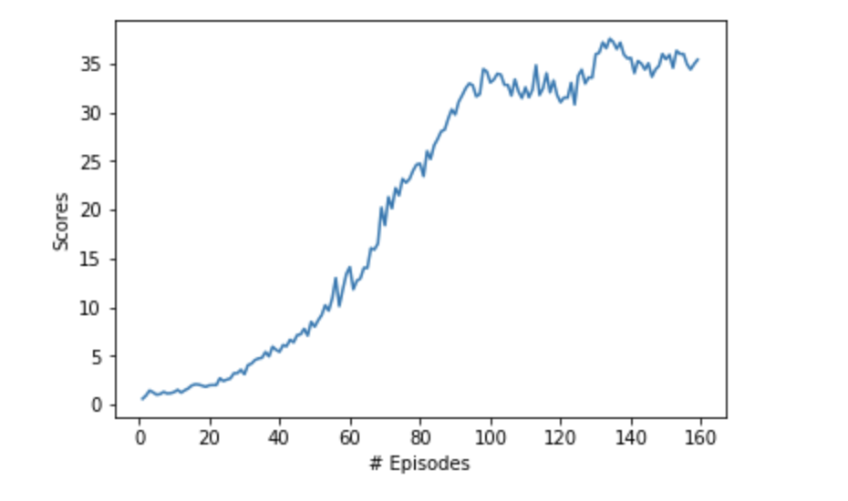

## Report regarding training of DDPG agent to play Unity ML Agents' Reacher Environment

###  Problem Statement

This project implements the training and inference of Unity ML Agents'  [Reacher environment](https://github.com/Unity-Technologies/ml-agents/blob/master/docs/Learning-Environment-Examples.md). 

In this environment, a double-jointed arm can move to target locations. A reward of +0.1 is provided for each step that the agent's hand is in the goal location, where the goal is keeping the arm in contact with the moving ball. In the above animation, the ball changes color from blue to green when the agent stays in contact with the ball. The goal of the agent is to maintain its position at the target location for as many time steps as possible. 

There are 2 versions of the Unity environment, one with a single environment and one with 20 environments, which can be used by 20 agents.

The observation space consists of 33 variables corresponding to position, rotation, velocity, and angular velocities of the arm. Each action is a vector with four numbers, corresponding to torque applicable to two joints. Every entry in the action vector should be a number between -1 and 1.

The environment is considered solved if the agent reaches a score of +30.0 in 100 consecutive episodes. For 20 agents, one needs to get the same score over 100 consecutive episodes, but averaged over all agents for each episode.

### Learning Algorithm

To solve the environment, I used the Deep Deterministic Policy Gradient DDPG algorithm (see [here](https://arxiv.org/pdf/1509.02971.pdf) for the paper introducing it). 

On the surface, DDPG looks like an actor-critic model, because we have two networks. Strictly speaking though, it's not an actor-critic model, though the authors said that it was. Thus, let's first refresh what an actor-critic model is about. 

Actor-critic models are not only based on two networks, they are based on two different reinforcement learning approaches. The actor network is normally a Monte Carlo-based, value function predicting model. The strength of such a network is that it's unbiased, because entire episodes are rolled out by collecting actual feedback from the environment. Unfortunately, they are also high variance, because many trajectories can pass through the same state. Also, rolling out entire episodes means that the actor is very data-inefficient. The critic is the opposite - it's a policy network, which uses a temporal difference (TD) approach, which means that only one step has to be simulated (the immediate interaction). The discounted future reward is taken from a prediction, but since we then use an estimate rather than a roll-out, a TD approach can have bias, even though it has reduced variance (because there's only one direct interaction with the environment). Combining the no-bias, high-variance actor and the low-bias, low-variance critic, we eventually get the actor which is both lower variance and has some initial guesses to work off of to speed up convergence. Of course, once the model is train, we discard the critic and just use the actor for inference, so inference is still efficient. Training may require more compute, but the convergence is quicker and more stable, so having the critic help the actor is a net win.

It was worth explaining traditional actor-critic models to compare DDPG against them. In a lot of ways, even though DDPG has two networks, it's not really an actor-critic in the traditional sense. It can be seen as an approximate DQN. The reason is that the "critic" in DDPG is used to approximate the maximizer over the Q values of the next state, and not as a learned baseline. 

The main problem with DQN agents is that it's not obvious how to use them for problems with continuous action spaces. When a DQN outputs the Q values for each state-action pair (or rather, for the current state and each action), it's easy to choose the best action using the argmax over those outputs. However, what would we do if we have a continuous output? We no longer can take the argmax, because it's not a discrete action space anymore - we have to guess what the max should be. 

DDPG solves the continuous action space problem. We use 2 neural networks. Even though DDPG is not really a "true" actor-critic model (because it doesn't combine Monte Carlo action-value network with a TD learning-based policy network), let's use that terminology for now instead of referring to network 1 and network 2. In DDPG, the actor predicts the optimal policy deterministically. This means the actor gives only the best action, rather than a probability distribution over actions. In other words, the actor predicts argmaxaQ(s, a). Of course, it's not a discrete argmax because the actions are continuous, it's the action which is somewhere on the real line of continuous values that ends up maximizing Q. Let's call this $\mu(s, \theta_{\mu}$). 
The critic learns to evaluate the optimal value function based on the actor's best chosen action. We can write this as $Q(s, \mu(s, \theta_{\mu}); \theta_Q)$. To rephrase, we use the actor, which is an approximate maximizer, to calculate a new target value to train a new action-value function, which the critic provides.  This does sound like an approximate DQN. Another DQN-style feature is the use of the replay buffer. Another thing which is important to mention is the use of the soft update approach. In DQNs, there's a local network and a target network. The target is normally updated only once in a few hundred of thousand time steps, while the local actor is updated at each time step. The updates are then done to the target by copying the weights at those irregular intervals. The DDPG approach, and indeed one used in other modern architectures, is to make much smaller, but regular updates to the target by linearly interpolating between the target and the local actor. To make sure the updates are small, the weight attached to the contribution of the local actor is $0 <\tau<1$, with the value of $\tau$ being much closer to 0 than to 1, and with the weight attached to the last value of the target being $1-\tau$, which clearly then ends up being much closer to 1 than to 0.

Another thin

DDPG is model-free and off-policy (like Q-learning).

 
The report clearly describes the learning algorithm, along with the chosen hyperparameters. It also describes the model architectures for any neural networks.

### Implementation

A plot of rewards per episode is included to illustrate that either:

-   **_[version 1]_**  the agent receives an average reward (over 100 episodes) of at least +30, or
-   **_[version 2]_**  the agent is able to receive an average reward (over 100 episodes, and over all 20 agents) of at least +30.

The submission reports the number of episodes needed to solve the environment.

### Reward plot

Here we can see the reward plot from a training session. The blue line represents instantaneous reward, while the orange line shows the 100-episode moving average. The latter is useful to see whether how the model is converging, because immediate reward is noisy. Note again that while the minimum 100-episode average to consider the environment solved is 13, I decided to train until 15. As we will see, the inference based on training to 15 doesn't seem to show overfitting.

### Ideas for future work

The submission has concrete future ideas for improving the agent's performance.
